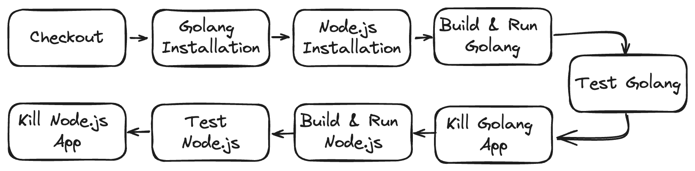
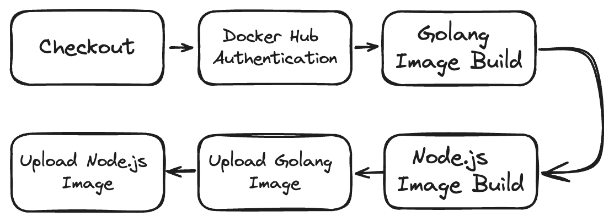

# CI/CD on Kubernetes

A tech company uses mono repo to maintain the code version, there are two backend
services built using Go and Nodejs. Also, they use Kubernetes to manage their
container.

## Tasks
### 1. Create a simple app using Go and Node.js

For this task I create two simple "Hello World" Go and Node.js 
- For Golang app you can find it in go-service folder
- For Node.js app you can find it in node-service folder

The app is will print "Hello" if get hitted.

Also, on both of the folder there is Dockerfile that will be used to build docker image. <br> <br>

### 2. Create CI/CD

For this task I used Github Action as CI/CD tools.
You can find the CI/CD configuration in the .github/workflows/cicd.yaml

```yaml
on:
  pull_request:
    branches:
      - main

    types:
      - closed
```
Above are configuration for CI/CD trigger. This CI/CD will run if there is Pull Request that closed to main branch. 

There are two jobs that will be run on this CI/CD, ***build-and-test*** and ***build-image***. Both of the jobs will be run if the Pull Request is Merged. So, the CI/CD will be really run if there is Pull Request that is closed and merged to main branch.<br> <br>

For ***build-and-test*** there are 9 steps that will be run.
<p>
  
</p>  

#### Here are the breakdown of the steps:
- On the **Checkout** step code will be clone.
- On this job Golang and Node.js App are will be build or run, so on this job need to install or use both Golang and Node. For the Golang version that used is 1.19 and for Node.js is 16.
- For the **Build & Run Go App** it will build the executable of Golang App. Then it will run the executable on the background and wait for 5 second before running next step. This 5 second delay is used to wait the execution of Golang app. On this step if it failed it will not break the job.
- Then, for the **Golang Test** it will be running if the previous step **Build & Run Go App** is success. This step is simple curl test to the check if the Golang executable is properly running and giving expected respond.
- After that on step **Kill Go App** it will kill the Golang executable so the port can be used for node.js application later.
- Then **Build & Run Node.js** step will be running with specifying working directory where the node.js file existing which is in the folder node-service. It first will install the dependencies that already declared on the package.json and then will run the node.js file on background. And, will wait for 5 second before running next step.
- Same thing with test step for golang app **Node.js Test** and **Kill Node.js App** will curl to the Node.js app if the **Build & Run Node.js** is success and will kill the node.js App after that.
<br><br>

For ***build-image*** jobs it will build image for golang and node.js app and then will push it to Docker Hub.
<p>
  
</p>  

#### Here are the breakdown of the build-image job:
- First, on the **Checkout** step code will be clone.
- Then on **Docker Hub Authentication** will use secret variable $DOCKERHUB_USERNAME and $DOCKERHUB_PASSWORD that already being setup before to Sign In on Docker Hub.
- After that on **Docker Image Build Go** will build docker image for Golang App using Dockerfile in the folder go-service. The Dockerfile will build an executable file of Golang App with name of the executable is "main", after that container set to expose its 8080 port and will set to run the "main" executable file if the container started.
- For the **Docker Image Build Node** will build docker image for Node.js App using Dockerfile in the folder node-service. Dockerfile will copy the service.js and package.json file and then will install listed dependencies on package.json, after that container set to expose its 8080 port and will set to run the "service.js" file if the container started.
- After that on step **Docker Go Push to Docker Hub** and **Docker Node Push to Docker Hub** will push the Go and Node.js that already build to the Dockerhub registry (yogatrista/sre-test-pintu).
<br><br>

### 3. Kubernetes Deployment
For kubernetes deployment I use minikube on my local laptop as a cluster. And, I use ngrok to expose the service so it can be access from the internet using domain that has ben set up.
<br><br>

#### Ngrok Configuration
For the Ngrok configuration on kubernetes I follow this official documentation from Ngrok. (https://ngrok.com/docs/using-ngrok-with/k8s/)
<br><br>

For all the related kubernetes manifest is listed in file **kubernetes-manifest**. And, using namespace of **sre-test-pintu**

#### Kubernetes Manifest (deployment.yaml)
On, the deployment manifest created two deployment named *go-service* and *node-service*, both of the deployment having replica of 2 pods and having exposed port of 8080. 
For the *go-service* deployment will be using image of (yogatrista/sre-test-pintu:go-arm) and for the *node-service* deployment will use image of (yogatrista/sre-test-pintu:go-arm). Since I run the minikube on arm machine and the Github Action for the free tier only can use ubuntu runner, I use manually build image from my marm machine to be use on the kubernetes deployment.
<br><br>

#### Kubernetes Manifest (service.yaml)
For the service manifest will create two service of *go-service* and *node-service* that will expose the container port of 8080 to the target port of 8080. And the selector of each service is matched with the selector of (app: node-service) that declared on the deployment.yaml
<br><br>

#### Kubernetes Manifest (ngrok-ingress.yaml)
This manifest is configuring the ingress to the each service *go-service* and *node-service*. On this case since the kubernetes cluster is using minikube. Ngrok is ultilise to expose the service to public, so it can be access using given ngrok domain. The service can be access using http://cockatoo-included-bison.ngrok-free.app domain.
To access the *node-service* can be access on http://cockatoo-included-bison.ngrok-free.app/ and the *go-service* can be access using http://cockatoo-included-bison.ngrok-free.app/go .